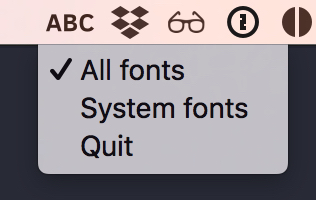
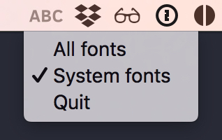

	
	 
	 

# Lose The Fonts

Toggles the custom installed fonts on your local machine.

So that you can test that your cloud-based font services are working as they should.

Download the latest release [here](https://github.com/connorholyday/lose-the-fonts/releases)

    
	

## But why

When developing digital services it's important to check that
any custom fonts you are using are loading correctly. This
app will toggle any custom installed fonts to ensure that
you'll only be seeing the ones that your services are loading in.

## How it works

On OSX your fonts are located in the `~/Library/Fonts/` directory.
This app works by moving these fonts to `~/Library/LoseTheFonts/`
when activated, and moving them back when deactivated.

## Build instructions

First install Electron and Electron Packager.

To run the app in development mode:
`npm run start`

To build the app:
`electron-packager . --overwrite --icon "./app-icon.icns"`

## License

MIT © [Connor Holyday](https://holyday.me)
